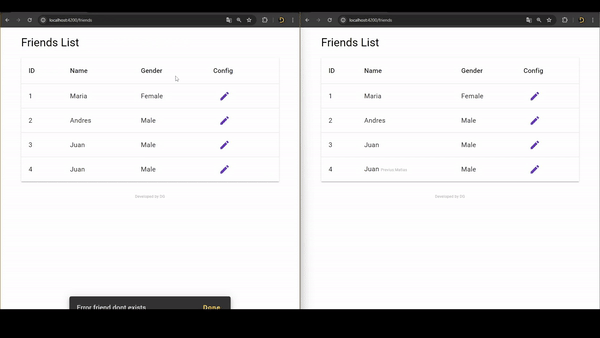

# QPlan - Challenge


## Tecnologias
<p align="center">

</p>

## Instrucciones

## Backend

Para ejecutar el proyecto de backend NODE ejecutar los siguientes comandos:


1. Colocarse en la carpeta con cd ```cd qplan-back```
2. Copiar el ```.env.template``` y renombrar a ```.env```.

3. Ejecutar
   ```npm install```

4. Levantar la base de datos con docker
   ```docker-compose up -d```

5. Ejecutar el comando ``` npm run db:migrate ``` y ``` npm run db:seed```

5. Levantar el backend de Node con el comando ```npm run start```

6. Visitar el sitio: ```localhost:3000/friends```

## Frontend

1. Colocarse en la carpeta ```cd qplan-angular```
2. Ejecutar ```npm install```
3. Ejecutar ``` npm run start ```
4. Visitar el sitio ```http://localhost:4200```


## Demo

Cuando un nombre es actualizado todos usuarios conectados a la aplicación pueden ver los cambios en tiempo real.



Los patrones empleados son:

- MVC (Modelos y Controladores)
- Singlenton (Servicios Angular, WebSocket)